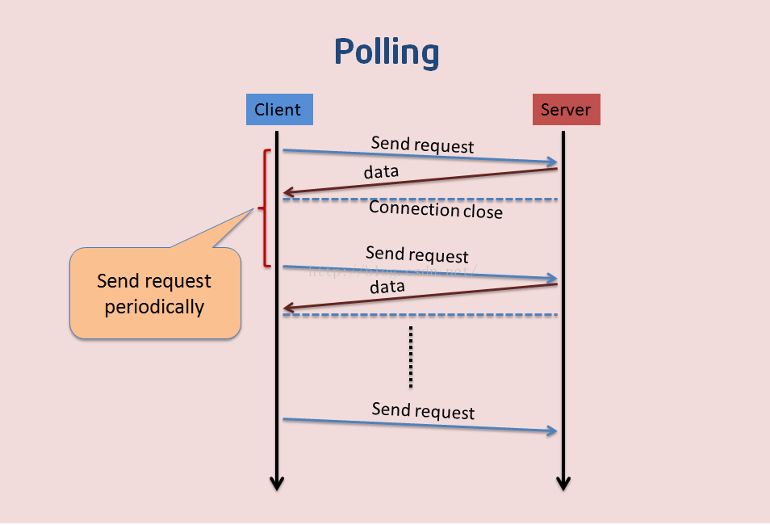
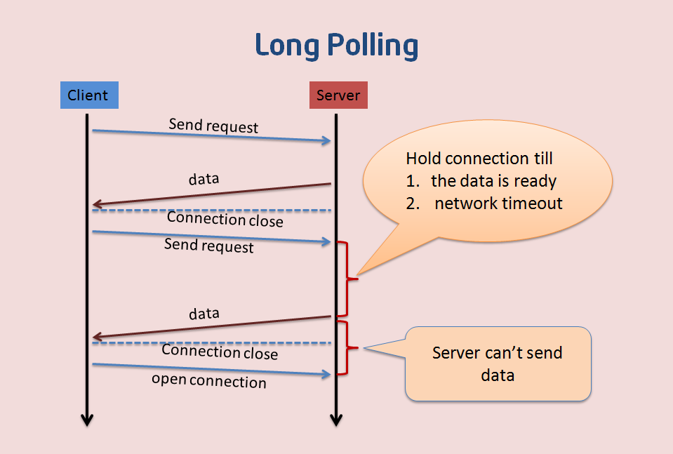
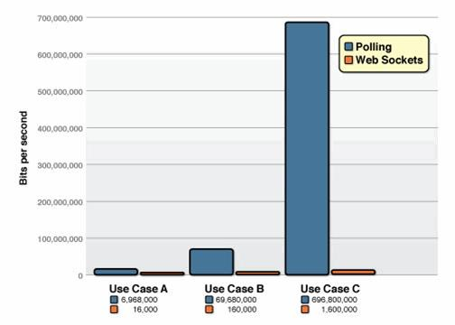
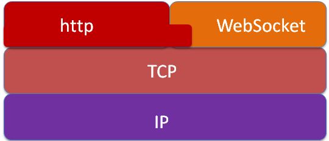
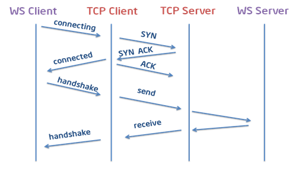
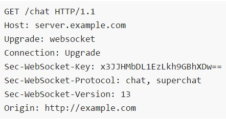
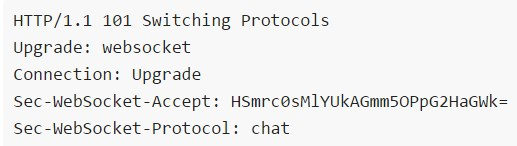
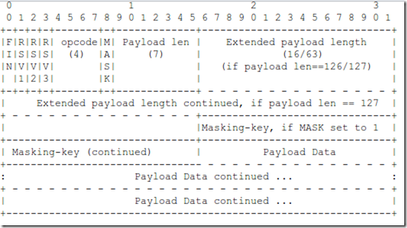
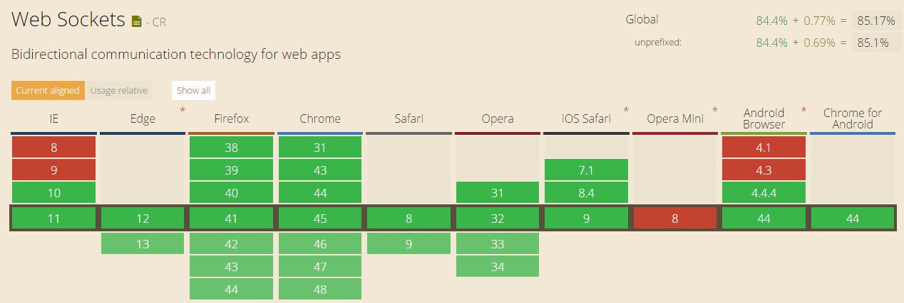

# WebSocket 简介

## 一、背景

http 协议是一种单向的网络协议。其特点是只能有客户端向服务端主动发起请求，服务端被动响应。在实际场景中，很多应用比如监控、即时通信、即时报价等都需要将服务端发生的变化实时推送给客户端。传统的 http 协议要实现这种效果，只能通过客户端不断地刷新、发送请求实现，效率不高。

Web 中实现实时通信，目前主要有如下几种方式：

### 1、轮询（polling）

这种方式通过客户端按一定的频率间隔向服务端发送查询请求实现。比如，在 js 中通过 setTimeout 设置定时器，以一定的频率间隔发送 ajax 请求到服务端获取最新的数据。如下图所示：



轮询通过周期查询实现实时推送的效果。缺点也很明显：存在空载查询，浪费带宽，消耗服务器资源。间隔时间短，空载查询就多。间隔时间长，达不到实时推送的效果。

### 2、长轮询（comet）

这种方式是对轮询方式的一种改进。原理是客户端发起查询请求后，服务端会阻塞这个请求直到有数据返回或者连接超时。当客户端收到响应后，再发起一个查询请求等待服务端响应。如下图所示：



长轮询通过阻塞请求，解决了空载查询的问题。但是，由于轮询、长轮询都是利用 http 协议，每次请求都会携带 http 包头信息。通常 http 包头比推送的数据要大的多。还是存在带宽浪费的问题。

### 3、websocket

`websocket`是`HTML5`制定的一种新的协议。它实现了客户端与服务器全双工通信（`full-duplex`）。完全解决了上面两张方式中存在的问题。是 web 实时通信的首选方案。

## 二、WebSocket 简介

WebSocket 是 HTML5 开始提供的一种在单个 TCP 连接上进行全双工通讯的协议。目的是取代轮询和 Comet 技术，使客户端浏览器具备像 C/S 架构下桌面系统的实时通讯能力。

客户端通过 JavaScript 向服务端发出建立 WebSocket 连接的请求，连接建立以后，客户端和服务端就可以通过 TCP 连接直接交换数据。

`WebSocket` 使得客户端和服务器之间的数据交换变得更加简单，允许服务端主动向客户端推送数据。在 `WebSocket API` 中，浏览器和服务器只需要完成一次握手，两者之间就直接可以创建持久性的连接，并进行双向数据传输。

在 `WebSocket API` 中，浏览器和服务器只需要做一个握手的动作，然后，浏览器和服务器之间就形成了一条快速通道。两者之间就直接可以数据互相传送。

Websocket 具有数据传输稳定、数据传输量小等特点。客户端与服务端之间的数据包文件头大概只有 2 个字节。轮询与 websocket 的性能比较如下图所示：



## 三、WebSocket 协议

### 1、websocket 与 TCP、HTTP 的关系

`websocket`协议本质上是基于`TCP`协议。其`url`前缀是`ws://`和`wss://`。它与`TCP`、`HTTP`协议的关系如下：



`websocket`协议的实现需要借助于`HTTP`协议。 因为握手阶段需要使用`HTTP`协议，所以也有人理解为"HTTP 握手+TCP 数据传输"的协议。

### 2、websocket 协议握手过程

`Websocket`协议握手过程如下所示：



#### 2.1、客户端与服务端通过 TCP 三次握手建立连接。

### 2.2、在 TCP 建立连接成功后，客户端通过 HTTP 协议传送 websocket 协议相关信息给服务器端。

### 2.3、服务端收到客户端发送来的握手请求后，如果包数据和格式正确，就接收本次握手连接，并给出相应的数据回复。

**握手请求和响应包如下所示**





### 3、websocket 数据帧格式

`websocket`的数据传输是以`frames`形式传输的，比如会将一条消息分为几个`frames`，按照先后顺序传输出去。数据帧格式如下所示：



**字段说明：**

    IN：1bit，用来表示这是一个消息的最后一帧，当然第一个消息片段也可能是最后一帧。
    
    RSV1、RSV2、RSV3：分别1bit，如果双方之间没有约定的自定义协议，那么这几位必须为0。
    
    Opcode：4bit，用于描述消息类型，消息类型暂定15种。
    
            *  %x0 表示连续消息片断
    
            *  %x1 表示文本消息片断
    
            *  %x2 表未二进制消息片断
    
            *  %x3-7 为将来的非控制消息片断保留的操作码
    
            *  %x8 表示连接关闭
    
            *  %x9 表示心跳检查的ping
    
            *  %xA 表示心跳检查的pong
    
            *  %xB-F 为将来的控制消息片断的保留操作码
    
        Mask：1bit，定义传输的数据是否有加掩码。
    
        Payloadlen：传输的数据长度，以bits的形式表示：7bits、7+16bits、7+64bits。如果数据长度在0-125bytes内，那么只要7bit就可以表示数据长度。如果数据长度大125小于UINT16 bytes，那么前7bit值为126，后面2bytes表示真实的数据长度。如果数据长度大于UINT16 bytes小于UINT64 bytes，那么前7bit值为127，后面的4bytes表示真实的数据长度。
    
        Masking-key：0bit或4bytes，如果Mask为0，没有该值。如果Mask为1，为一个32bit的掩码。
    
        Payload Data：（x+y）bit，负载数据为扩展数据和应用数据长度之和。
    
        Extension Data：x位，如果客户端与服务端没有特殊约定，那么扩展数据位为0。
    
        Application Data：y位，应用数据，放在扩展数据后。

### 4、浏览器支持



## 四、WebSocket 实现

    目前各种语言都有websocket实现库或框架。这里只列出基于node的websocket框架：
    + socket.io
    + einaros/ws
    + engine.io
    + primus

### **JAVA 实现 WebSocket 的三种方式**

1. 使用`Tomcat`的 WebSocket 实现，需要`tomcat 7.x`，JEE7 的支持，无需别的任何配置，只需服务端一个处理类，原生注解
   
   说明
   
   这里有几个注解需要注意一下，首先是他们的包都在 **javax.websocket** 下。并不是 spring 提供的，而 jdk 自带的，下面是他们的具体作用。
   
   1.  **@ServerEndpoint**
      1. 通过这个 spring boot 就可以知道你暴露出去的 ws 应用的路径，有点类似我们经常用的@RequestMapping。比如你的启动端口是8080，而这个注解的值是ws，那我们就可以通过 ws://127.0.0.1:8080/ws 来连接你的应用
   2.  **@OnOpen**
      1. 当 websocket 建立连接成功后会触发这个注解修饰的方法，注意它有一个 Session 参数
   3. **@OnClose**
      1. 当 websocket 建立的连接断开后会触发这个注解修饰的方法，注意它有一个 Session 参数
   4. **@OnMessage**
      1. 当客户端发送消息到服务端时，会触发这个注解修改的方法，它有一个 String 入参表明客户端传入的值
   5. **@OnError**
      1. 当 websocket 建立连接时出现异常会触发这个注解修饰的方法，注意它有一个 Session 参数
   
   另外一点就是服务端如何发送消息给客户端，服务端发送消息必须通过上面说的 Session 类，通常是在@OnOpen 方法中，当连接成功后把 session 存入 Map 的 value，key 是与 session 对应的用户标识，当要发送的时候通过 key 获得 session 再发送，这里可以通过 **session.getBasicRemote().sendText()** 来对客户端发送消息。

2. spring boot 中使用 websocket 实现点对点通信与服务器推送
   使用 Spring 的 WebSocket 实现，需要 spring 4.x，并且使用了 socketjs，对不支持 websocket 的浏览器可以模拟 websocket 使用，本文主要介绍这种方式。

3. 使用 Netty 的 WebSocket 实现，高性能、高可靠性.

### STOMP 协议简介

它是高级的流文本定向消息协议，是一种为 MOM (Message Oriented Middleware，面向消息的中间件) 设计的简单文本协议。

它提供了一个可互操作的连接格式，允许 STOMP 客户端与任意 STOMP 消息代理 (Broker) 进行交互，类似于 OpenWire (一种二进制协议)。

由于其设计简单，很容易开发客户端，因此在多种语言和多种平台上得到广泛应用。其中最流行的 STOMP 消息代理是 Apache ActiveMQ。

STOMP 协议使用一个基于 (frame) 的格式来定义消息，与 Http 的 request 和 response 类似 。

```
>>> SEND
transaction:tx-0
destination:/app/marco
content-length:20

{"message":"Marco!"}
```

1. SEND：STOMP命令，表明会发送一些内容；
2. destination：头信息，用来表示消息发送到哪里；
3. content-length：头信息，用来表示 负载内容的 大小；
4. 空行：
5. 帧内容（负载）内容
   
