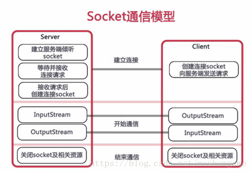
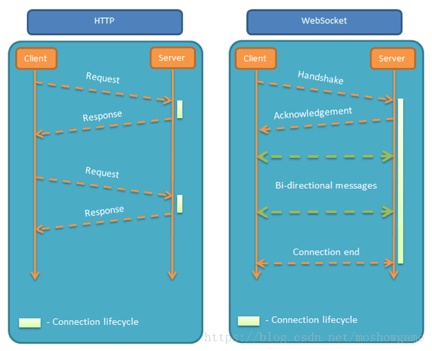
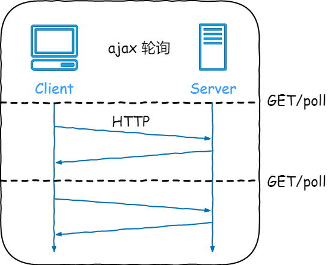
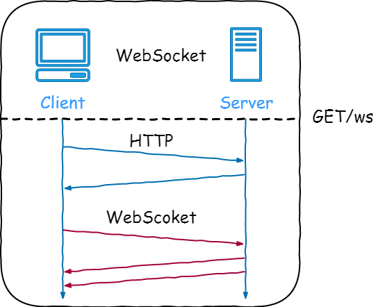

# Spring Boot 集成 WebSocket 实现服务端推送消息到客户端

## 一、什么是websocket？

`WebSocket` 协议是基于 `TCP` 的一种新的网络协议。

WebSocket协议是基于TCP的一种新的网络协议。它实现了浏览器与服务器全双工(full-duplex)通信——允许服务器主动发送信息给客户端。学过计算机网络都知道，既然是全双工，就说明了**服务器可以主动发送信息给客户端**。



## 

## 二、为什么需要 WebSocket？

初次接触 `WebSocket` 的人，都会问同样的问题：我们已经有了`HTTP`协议，为什么还需要另一个协议？它能带来什么好处？

- 答案很简单，因为`HTTP` 协议有一个缺陷：***通信只能由客户端发起***，`HTTP`协议做不到服务器主动向客户端推送信息。
  
  

- 举例来说，我们想要查询当前的排队情况，只能是页面轮询向服务器发出请求，服务器返回查询结果。轮询的效率低，非常浪费资源（因为必须不停连接，或者`HTTP` 连接始终打开）。因此`WebSocket`就是这样发明的。

假设有这样一个场景：服务端的资源经常在更新，客户端需要尽量及时地了解到这些更新发生后展示给用户，如果是 `HTTP 1.1`，通常会开启 [ajax](https://so.csdn.net/so/search?q=ajax&spm=1001.2101.3001.7020) 请求询问服务端是否有更新，通过定时器反复轮询服务端响应的资源是否有更新。

### Ajax 轮询

在长时间不更新的情况下，反复地去询问会对服务器造成很大的压力，对网络也有很大的消耗，如果定时的时间比较大，服务端有更新的话，客户端可能需要等待定时器达到以后才能获知，这个信息也不能很及时地获取到。



而有了 `WebSocket` 协议，就能很好地解决这些问题，`WebSocket` 可以反向通知的，通常向服务端订阅一类消息，服务端发现这类消息有更新就会不停地通知客户端。

### WebSocket

`WebSocket` 协议是基于 `TCP` 的一种新的网络协议，它实现了浏览器与服务器全双工`（full-duplex）`通信—允许服务器主动发送信息给客户端，这样就可以实现从客户端发送消息到服务器，而服务器又可以转发消息到客户端，这样就能够实现客户端之间的交互。对于 `WebSocket` 的开发，`Spring` 也提供了良好的支持，目前很多浏览器已经实现了 `WebSocket` 协议，但是依旧存在着很多浏览器没有实现该协议，为了兼容那些没有实现该协议的浏览器，往往还需要通过 `STOMP` 协议来完成这些兼容。



## 三、基于H5 WebSocket实现

下面我们在 Spring Boot 中集成 WebSocket 来实现服务端推送消息到客户端。

Spring Boot 集成 WebSocket
首先创建一个 `Spring Boot` 项目，然后在 `pom.xml` 加入如下依赖集成 `WebSocket`：

```xml
<dependency>
    <groupId>org.springframework.boot</groupId>
    <artifactId>spring-boot-starter-websocket</artifactId>
</dependency>
```

### 开启配置

接下来在 config 包下创建一个 WebSocket 配置类 WebSocketConfiguration，在配置类上加入注解 @EnableWebSocket，表明开启 WebSocket，内部实例化 ServerEndpointExporter 的 Bean，该 Bean 会自动注册 @ServerEndpoint 注解声明的端点，代码如下：

```java
@Configuration
@EnableWebSocket
public class WebSocketConfig {

    @Bean
    public ServerEndpointExporter serverEndpointExporter() {
        return new ServerEndpointExporter();
    }

}
```

### 编写端点服务类

接下来使用 `@ServerEndpoint` 定义一个端点服务类，在端点服务类中，可以定义 `WebSocket` 的打开、关闭、错误和发送消息的方法，具体代码如下所示：

```java
@ServerEndpoint("/websocket/{userId}")
@Component
public class WebSocketServer {

    private static final Logger log = LoggerFactory.getLogger(WebSocketServer.class);

    /**当前在线连接数，静态变量，用来记录当前在线连接数。应该把它设计成线程安全的。*/
    private static AtomicInteger onlineCount = new AtomicInteger(0);

    /**用来存放每个客户端对应的 WebSocketServer 对象， concurrent包的线程安全Set，用来存放每个客户端对应的MyWebSocket对象。*/
    private static ConcurrentHashMap<String, WebSocketServer> webSocketMap = new ConcurrentHashMap<>();

    /**与某个客户端的连接会话，需要通过它来给客户端发送数据*/
    private Session session;

    /**
     * 接收 userId
     */
    private String userId = "";

    /**
     * 连接建立成功调用的方法
     * @param session
     * @param userId
     */
    @OnOpen
    public void onOpen(Session session, @PathParam("userId") String userId) {
        this.session = session;
        this.userId = userId;
        // int nowOnlineCount = 0;
        if (webSocketMap.containsKey(userId)) {
            webSocketMap.remove(userId);
            //加入到map中;
            webSocketMap.put(userId, this);
        } else {
            //加入到map中;
            webSocketMap.put(userId, this);
            // 在线人数加1
            // nowOnlineCount = onelineCount.incrementAndGet();
            addOnlineCount();
        }
        log.info("用户：{} 连接成功，当前在线人数为:{}", userId, getOnlineCount());
        try {
            // 发送消息，检验是否连接成功
            sendMessage("来自服务器端的提示消息，ID为{}, 的用户连接成功！");
        } catch (IOException e) {
            log.error("用户:{} 连接失败，网络异常!!!!!!", userId);
        }
    }

    /**
     * 连接关闭调用的方法
     */
    @OnClose
    public void onClose() {
        // 记录当前的在线连接数
        int nowOnlineCount = 0;
        if (webSocketMap.containsKey(userId)) {
            // 移除对应的WebSocket对象， 相应的在线连接数减1
            webSocketMap.remove(userId);
            // nowOnlineCount = onelineCount.decrementAndGet();
            subOnlineCount();
        }
        log.info("用户:{} 断开连接，当前在线人数为:{}", userId, getOnlineCount());
    }

    /**
     * 收到客户端消息后调用的方法
     *
     * @param message 客户端发送过来的消息
     * @param session
     */
    @OnMessage
    public void onMessage(String message, Session session) {
        log.info("用户消息: {}，报文:{}", userId, message);
        if (!StringUtils.isEmpty(message)) {
            try {
                // 解析发送报文
                // JSONObject jsonObject = JSON.parseObject(message);
                // jsonObject.put("fromUserId", this.userId);
                // String toUserId = jsonObject.getString("toUserId");

                ObjectMapper mapper = new ObjectMapper();
                JsonNode jsonObject = mapper.readTree(message);
                // 追加发送人（防止窜改）
                ((ObjectNode) jsonObject).put("fromUserId", this.userId);
                String toUserId = jsonObject.path("toUserId").asText();
                // 传送给对应toUserId用户的websocket
                if (!StringUtils.isEmpty(toUserId) && webSocketMap.containsKey(toUserId)) {
                    webSocketMap.get(toUserId).sendMessage(jsonObject.toString());
                } else {
                    log.error("请求的 userId:{}，不在该服务器上", toUserId);
                }
            } catch (Exception e) {
                e.printStackTrace();
            }
        }
    }

    /**
     * 发生错误时调用
     *
     * @param session
     * @param error
     */
    @OnError
    public void onError(Session session, Throwable error) {
        log.error("用户错误:{}，原因:{}", this.userId, error.getMessage());
        error.printStackTrace();
    }

    /**
     * 实现服务器主动推送
     * @param message
     * @throws IOException
     */
    public void sendMessage(String message) throws IOException {
        this.session.getBasicRemote().sendText(message);
    }

    /**
     * 给指定的用户发送消息
     * @param userId  用户
     * @param message 消息内容
     */
    public static void sendToUser(@PathParam("userId") String userId, String message)
            throws IOException {
        log.info("发送消息到：{}，报文：{}", userId, message);
        if (!StringUtils.isEmpty(userId) && webSocketMap.containsKey(userId)) {
            webSocketMap.get(userId).sendMessage(String.format("来自用户：%s 发送的消息，内容：%s", userId, message));
        } else {
            log.info("用户{}，不在线！", userId);
        }
    }

    /**
     * 群发消息，给所有用户发送消息
     *
     * @param message 消息内容
     */
    public static void sendToAll(String message) {
        webSocketMap.values().stream().forEach(webSocketServer -> {
            try {
                webSocketServer.sendMessage(message);
            } catch (IOException e) {
                log.error("群发消息失败，异常信息：{}", e.getMessage());
            }
        });
    }

    /**
     * 定时给所有用户发送消息
     *
     */
    @Scheduled(cron  = "0/2 * * * * ?")
    public static void schedule(){
        webSocketMap.values().stream().forEach(webSocketServer -> {
            try {
                webSocketServer.sendMessage("定时消息");
            } catch (IOException e) {
                log.error("群发消息失败，异常信息：{}", e.getMessage());
            }
        });
    }

    public static synchronized AtomicInteger getOnlineCount() {
        return onlineCount;
    }

    public static synchronized void addOnlineCount() {
        WebSocketServer.onlineCount.getAndIncrement();
    }

    public static synchronized void subOnlineCount() {
        WebSocketServer.onlineCount.getAndDecrement();
    }
```

其中，`@ServerEndpoint("/websocket/{userId}")`表示让 `Spring` 创建 `WebSocket` 的服务端点，其中请求地址是 `/websocket/{userId}`。

另外 `WebSocket` 一共有四个事件，分别对应 `JSR-356` 定义的 `@OnOpen`、`@OnMessage`、`@OnClose`、`@OnError` 注解。

`@OnOpen`：标注客户端打开 WebSocket 服务端点调用方法

`@OnClose`：标注客户端关闭 WebSocket 服务端点调用方法

`@OnMessage`：标注客户端发送消息，WebSocket 服务端点调用方法

`@OnError`：标注客户端请求 WebSocket 服务端点发生异常调用方法

接下来启动项目，使用 [WebSocket 在线测试工具](http://www.easyswoole.com/wstool.html) 进行测试，有能力的也可以自己写个 html 测试。

打开网页后，在服务地址中输入`ws://127.0.0.1:8080/websocket/admin`，点击开启连接按钮，消息记录中会多一条由服务器端发送的连接成功！记录。

接下来再打开一个网页，服务地址中输入`ws://127.0.0.1:8080/websocket/admin`，点击开启连接按钮，然后回到第一次打开的网页在消息框中输入{"toUserId":"test","message":"i love you"}，点击发送到服务端，第二个网页中会收到服务端推送的消息{"fromUserId":"admin","message":"i love you","toUserId":"test"}。

同样，项目的日志中也会有相应的日志：

```textile
2020-06-30 12:40:48.894  INFO 78908 --- [nio-8080-exec-1] com.hsiao.springboot.websocket.h5.server.WebSocketServer          : 用户连接:admin,当前在线人数为:1
2020-06-30 12:40:58.073  INFO 78908 --- [nio-8080-exec-2] com.hsiao.springboot.websocket.h5.server.WebSocketServer          : 用户连接:test,当前在线人数为:2
2020-06-30 12:41:05.870  INFO 78908 --- [nio-8080-exec-3] com.hsiao.springboot.websocket.h5.server.WebSocketServer          : 用户消息:admin,报文:{"toUserId":"test","message":"i love you"}
```

## 四、基于Spring提供的低层级WebSocket API实现

Spring 4.0为WebSocket通信提供了支持，包括：

- 发送和接收消息的低层级API；

- 发送和接收消息的高级API；

- 用来发送消息的模板；

- 支持SockJS，用来解决浏览器端、服务器以及代理不支持WebSocket的问题。

使用Spring提供的低层级API实现WebSocket，主要需要以下几个步骤：

## （1）添加一个WebSocketHandler：

定义一个继承了`AbstractWebSocketHandler`类的消息处理类，然后自定义对”建立连接“、”接收/发送消息“、”异常情况“等情况进行处理

```java
/**
* WebSocket相关配置
*/
@Configuration
@EnableWebSocket
public class WebSocketConfig implements WebSocketConfigurer{
    @Override
    public void registerWebSocketHandlers(WebSocketHandlerRegistry registry) {
        registry.addHandler(echoWebSocketHandler(), "/websocket");
        registry.addHandler(echoWebSocketHandler(), "/sockjs").withSockJS();
    }

    /**
     * 通过继承 {@link org.springframework.web.socket.handler.AbstractWebSocketHandler} 的示例
     */
    @Bean
    public WebSocketHandler echoWebSocketHandler(){
        return new EchoWebSocketHandler();
    }
}
```

从上面代码可以看出，这里除了配置了基本的`WebSocket`（也就是`/websocket`这个连接地址），还使用`SockJS`配置了浏览器不支持`WebSocket`技术时的替代方案（也就是`/sockjs`这个连接地址）。

**说明**
通过继承TextWebSocketHandler 类并覆盖相应方法，可以对 `websocket` 的事件进行处理，这里可以同原生注解的那几个注解连起来看

1. `afterConnectionEstablished`方法是在 socket 连接成功后被触发，同原生注解里的 `@OnOpen` 功能
2. `afterConnectionClosed`方法是在 socket 连接关闭后被触发，同原生注解里的 `@OnClose` 功能
3. `handleTextMessage` 方法是在客户端发送信息时触发，同原生注解里的`@OnMessage` 功能


具体实现：
[springboot stomp实现websocket](../springboot-websocket-stomp/README.md)

## 五、使用STOMP消息实现

所谓`STOMP(Simple Text Oriented Messaging Protocol)`，就是在`WebSocket`基础之上提供了一个基于帧的线路格式`（frame-based wire format`）层。它对发送简单文本消息定义了一套规范格式（STOMP消息基于Text，当然也支持传输二进制数据），目前很多服务端消息队列都已经支持`STOMP`，比如：`RabbitMQ`、 `ActiveMQ`等。

具体实现：
[springboot stomp实现websocket](../springboot-websocket-stomp/README.md)

## 六、使用Netty实现

### 参考

+ https://juejin.cn/post/6844903976727494669

+ https://github.com/wupeixuan/SpringBoot-Learn/blob/master/websocket

+ https://github.com/moshowgame/spring-cloud-study/blob/master/spring-cloud-study-websocket

+ [Spring Framework 中文文档](https://www.docs4dev.com/docs/zh/spring-framework/5.1.3.RELEASE/reference/web.html#websocket)

+ [WebSocket 在线测试 v13](http://www.websocket-test.com/)

+ [HTML5 WebSocket](https://www.runoob.com/html/html5-websocket.html)
